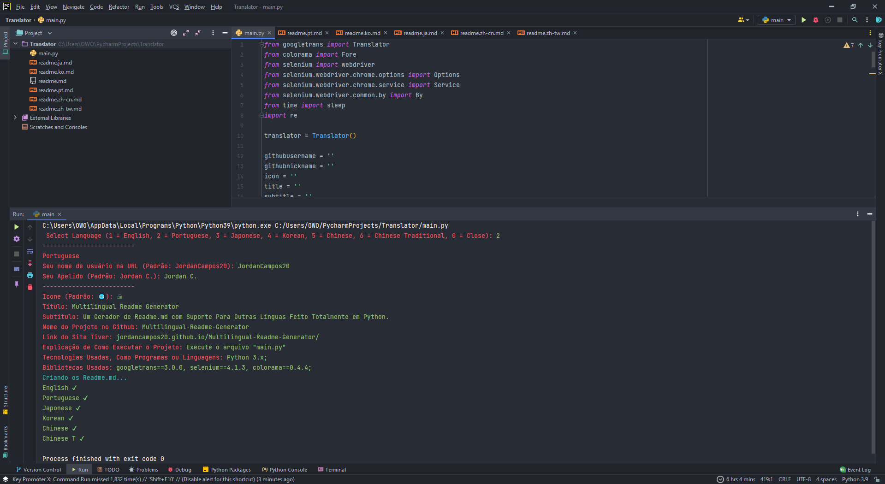

<h1 align="center">
  🖨<br>多言語のReadmeジェネレーター
</h1>

*Read this in other languages: [English](readme.md), [Portuguese](readme.pt.md), [한국어](readme.ko.md), [日本語](readme.ja.md), [简体中文](readme.zh-cn.md), [正體中文](readme.zh-tw.md).*

<h4 align="center">
  他の言語をサポートするReadme.mdジェネレーターは完全にPythonで作成されています。
</h4>

<p align="center"></p>

<h4 align="center"><a href="https://jordancampos20.github.io/Multilingual-Readme-Generator/">クリックしてプロジェクトを表示</a></h4>
<h4 align="center"><a href="https://github.com/JordanCampos20/Multilingual-Readme-Generator/archive/refs/heads/main.zip">クリックしてプロジェクトをダウンロード</a></h4>

---

## インストール
```
git clone https://github.com/JordanCampos20/Multilingual-Readme-Generator.git
```
```
pip install -r requirements.txt
```

```
python2とpython3を使用している場合は、requirements.txtをダウンロードするときにpip3を使用してください
```

## ランニング

```
「main.py」ファイルを実行します
```

---

## 💼 使用したテクノロジー
このアプリケーションの開発には、次のテクノロジを使用しました。

- Python 3.x;

---

## 📚 使用済みライブラリ
このアプリケーションの開発には、次のライブラリを使用しました。

- googletrans==3.0.0a0, selenium==4.1.3, colorama==0.4.4;

---

## 🦄 著者<br>
<table>
  <tr>
    <td align="center">
      <a href="https://github.com/JordanCampos20">
        <br>
        <sub>
          <b>Jordan C.</b>
        </sub>
      </a>
    </td>
  </tr>
</table>

---
