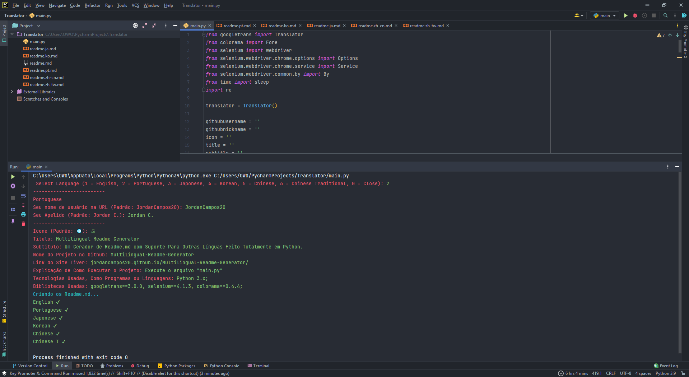

<h1 align="center">
  🖨<br>Multilingual Readme Generator
</h1>

*Read this in other languages: [English](readme.md), [Portuguese](readme.pt.md), [한국어](readme.ko.md), [日本語](readme.ja.md), [简体中文](readme.zh-cn.md), [正體中文](readme.zh-tw.md).*: 

<h4 align="center">
  A Readme.md Generator with Support for Other Languages ​​Made Entirely in Python.
</h4>

<p align="center"></p>

<h4 align="center"><a href="jordancampos20.github.io/Multilingual-Readme-Generator/">Click to see the project</a></h4>
<h4 align="center"><a href="https://github.com/JordanCampos20/Multilingual-Readme-Generator/archive/refs/heads/main.zip">Click to download project</a></h4>

---

## Installation
```
git clone https://github.com/JordanCampos20/Multilingual-Readme-Generator.git
```
```
pip install -r requirements.txt
```

```
If you have python2 and python3, use pip3 when downloading requirements.txt
```

## Running

```
Run the "main.py" file
```

---

## 💼 Technologies used
For the development of this application I used the following technologies:

- Python 3.x;

---

## 📚 Used Libraries
For the development of this application I used the following libraries:

- googletrans==3.0.0a0a0, selenium==4.1.3, colorama==0.4.4;

---

## 🦄 Author<br>
<table>
  <tr>
    <td align="center">
      <a href="https://github.com/JordanCampos20">
        <br>
        <sub>
          <b>Jordan C.</b>
        </sub>
      </a>
    </td>
  </tr>
</table>

---
